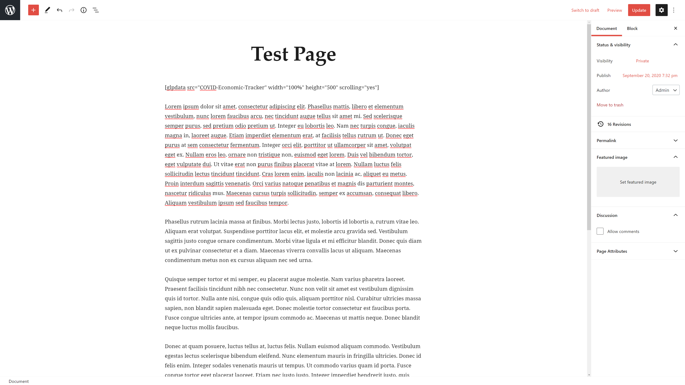
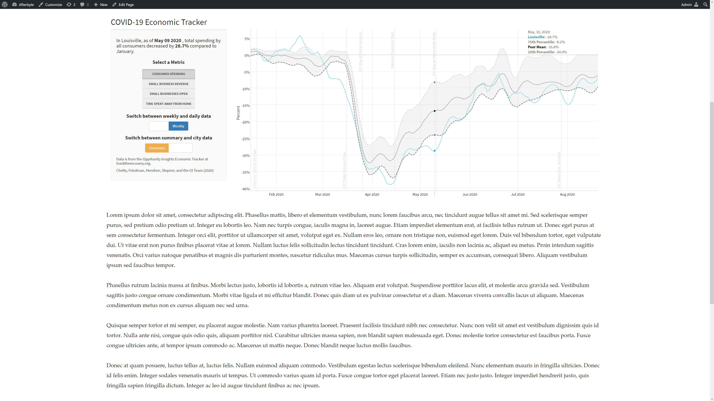

GLP Visualizer
======
**GLP Visualizer** is a WordPress plugin designed for the Greater Louisville Project's website. It seamlessly embeds maps, graphs, and charts from a [Shiny server](https://rstudio.com/products/shiny/shiny-server/) to give the end user a more interactive experience.

[User Manual](https://docs.google.com/document/d/1HlMxqchRd6JFHYSWK25-UzDdl2YmImwKMra1qlRK2Lo/edit?usp=sharing)

## Screenshots

## License 
[MIT](./LICENSE.md)
